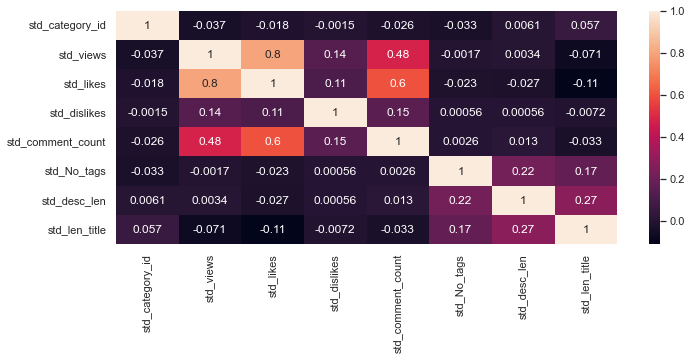
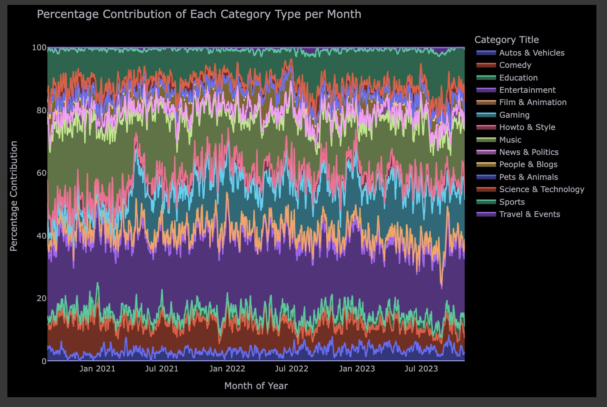

# CJMY
## Demo Link
https://drive.google.com/file/d/1SRLutDxY96unNP6dvJQlHY42Yhmcm00Z/view?usp=drive_link

## Professor:
- Greg Baker (ggbaker@cs.sfu.ca)

## Group Members:
- Yinuo Yao (yya290@sfu.ca)
- Yihui (Chloe) Zhang (yha261@sfu.ca)
- Yongxian (Monica) Hao (yza691@sfu.ca)
- Zhaoyan (Joyce) Liu (zla285@sfu.ca)

## Dataset Link:
- https://www.kaggle.com/datasets/datasnaek/youtube-new
- https://www.kaggle.com/datasets/rsrishav/youtube-trending-video-dataset

## Project Overview:
As a global hub for digital content, YouTube stands at the forefront of platforms favored by both content producers and audiences internationally. The examination of YouTube video metrics offers the opportunity to uncover significant insights. Accordingly, our analysis will leverage datasets detailing the daily trending videos on YouTube from the years 2017 to 2018 and 2020 to 2023. 

The time range of video publication notably influences trending patterns. Moreover, varying categories carry distinct weightings in trending; YouTube displays tendencies to favor specific categories during certain periods. Official videos tend to have higher chances of trending, and interaction metrics gradually gained importance in the trending algorithm. 'None' tags were most prevalent within trending videos, while titles of approximately 50 characters tended to trend more frequently. Additionally, a prevalent trend among YouTuber video titles involved referencing the specific year. Videos exhibiting rapid interaction spikes shortly after publication were more prone to trending. The duration a video remained 'Untrending' was directly related to its trending duration and the time taken to transition into trending status. Recognizing views as a pivotal aspect of the trending mechanism, we developed a machine learning model to predict the relationship between views and trending video status.

Fig 1. Correlation between features in the machine learning model

Fig 2. Percentage Contribution of Each Category Type per Month_France
